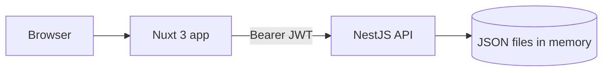

# Susi Air Pilot App

**Fullstack Developer Technical Test.** A small slice of the Susi Air Pilot App: a NestJS REST API and a Nuxt 3 mobile-first web app. Pilots sign in, see how close they are to their flight-hour limits, check document expiry, browse their monthly duty schedule and review their logbook.

## Quick start for reviewers

| | |
| --- | --- |
| **Frontend (live)** | https://susiair-pilot-test-1cyv.vercel.app |
| **Backend API (live)** | https://susiair-pilot-test.vercel.app (try [`/health`](https://susiair-pilot-test.vercel.app/health)) |
| **Login** | username `johndoe` / password `susiairtest` |
| **Repository** | https://github.com/MoriKaslana/susiair-pilot-test |

Best viewed at phone width. It is a mobile-first app; on desktop it renders as a centered column.

**Things to try**

1. Sign in with a wrong password to see the clear error message.
2. On **Home**, switch the chart between `1w`, `1m`, `3m`, `6m` and `1y`, and tap a point to see its tooltip.
3. Open **Schedule** and move between months (every move calls the API). Go back to March 2026 to see the empty state.
4. Tap a date to open the "Detail page coming soon" placeholder, then use Back.
5. Open **Logbook** and move between months. Days after 15 May are tagged "Planned".
6. Open **More** and sign out.

## Table of contents

- [Features](#features)
- [Tech stack](#tech-stack)
- [Architecture and repository structure](#architecture-and-repository-structure)
- [Setup and run](#setup-and-run)
- [Environment variables](#environment-variables)
- [API reference](#api-reference)
- [Frontend overview](#frontend-overview)
- [Key decisions and why](#key-decisions-and-why)
- [Edge cases handled](#edge-cases-handled)
- [Verifying the numbers](#verifying-the-numbers)
- [Testing](#testing)
- [Deployment](#deployment)
- [Note on AI assistance](#note-on-ai-assistance)
- [Known gaps and what I would change with more time](#known-gaps-and-what-i-would-change-with-more-time)

## Features

| Screen | What it does |
| --- | --- |
| **Sign in** | Username and password form with show/hide password, loading state, and separate messages for bad credentials and an unreachable server. |
| **Home** | Header with greeting, pilot name, total flight hours and avatar. Four limit cards (Daily, Weekly, Monthly, Annual) with progress bars. A rolling-sum chart with a `1w / 1m / 3m / 6m / 1y` toggle. A "My Documents" list with expiry badges. |
| **Schedule** | Monthly calendar (Monday first) with previous and next buttons. Day cells are coloured by the API, show a duty indicator, and highlight today. A legend sits below. Tapping a day opens a detail placeholder. |
| **Logbook** | Month view of flight hours: a bold month total and a list of the days with hours, with a "Planned" label for days after today. |
| **More** | Profile card (avatar, name, total flight hours), an About line and a Sign out button. |

Every section on every screen loads independently, with its own skeleton and an error state with a **Retry** button, so one failing request never blanks the page.

## Tech stack

- **Frontend (`/nuxt`):** Nuxt 3 (Composition API, `<script setup lang="ts">`), Pinia, SCSS, `lucide-vue-next` for line icons, Plus Jakarta Sans from Google Fonts. The chart is hand-written SVG with no chart library.
- **Backend (`/nest`):** NestJS 10 on Node.js, TypeScript, `class-validator` and `class-transformer` for validation, `@nestjs/jwt` for tokens, `@nestjs/config` for configuration. Jest for unit and e2e tests.
- **Data source:** the three provided JSON files, loaded into memory at startup. There is no database.

## Architecture and repository structure



```
/
├── nest/                          NestJS API
│   ├── src/
│   │   ├── main.ts                bootstrap
│   │   ├── app.module.ts
│   │   ├── app.setup.ts           validation pipe + CORS (shared by main.ts and e2e tests)
│   │   ├── config/                configuration (env vars, defaults)
│   │   ├── common/
│   │   │   ├── decorators/        @Public()
│   │   │   ├── guards/            JwtAuthGuard (global)
│   │   │   ├── filters/           AllExceptionsFilter (global)
│   │   │   ├── validators/        @IsIsoDate()
│   │   │   └── utils/             UTC date helpers
│   │   ├── data/                  DataService + the three JSON files (data/files/)
│   │   ├── auth/                  module, controller, service, DTO
│   │   ├── pilot/
│   │   ├── flight-hours/          includes rollingWindowBluffing()
│   │   ├── documents/
│   │   ├── schedules/
│   │   └── health/
│   └── test/                      e2e tests
└── nuxt/                          Nuxt 3 app
    ├── pages/                     login, index (Home), schedule/ (calendar, [date]), logbook, more
    ├── components/                chart, limit cards, document list, calendar, legend, state block, nav
    ├── stores/                    Pinia: auth, pilot, flightHours, documents, schedule, logbook
    ├── composables/               useApi, useDateFormat, useContrastColor
    ├── middleware/                global auth redirect
    ├── layouts/                   default (app shell + bottom nav), auth
    ├── utils/                     API error normalisation
    ├── types/                     API response types
    └── assets/scss/               design tokens and base styles
```

## Setup and run

Requirements: Node.js 20 or newer and npm.

### Backend

```bash
cd nest
npm install
cp .env.example .env      # optional: every variable has a sensible default
npm run start:dev         # http://localhost:3001
```

Production-style run: `npm run build && node dist/main`.

### Frontend

```bash
cd nuxt
npm install
cp .env.example .env      # sets NUXT_PUBLIC_API_BASE=http://localhost:3001
npm run dev               # http://localhost:3000
```

Start the backend first. Run the frontend on port 3000, because the backend's default CORS setting allows that origin (see `FRONTEND_ORIGIN`). To run against the live API instead, set `NUXT_PUBLIC_API_BASE=https://susiair-pilot-test.vercel.app`.

Production build: `npm run build`, then `npm run preview`.

On Windows PowerShell, use `copy .env.example .env` instead of `cp`.

## Environment variables

### Backend (`nest/.env`)

| Variable | Default | Purpose |
| --- | --- | --- |
| `PORT` | `3001` | HTTP port (hosting platforms set this themselves). |
| `JWT_SECRET` | `dev-secret-change-me` | Secret used to sign tokens. Set a long random value in production. |
| `APP_TODAY` | `2026-05-15` | The app's "today" (see [decisions](#key-decisions-and-why)). |
| `FRONTEND_ORIGIN` | `http://localhost:3000` | Allowed CORS origin(s). Comma-separated list, exact origins, no trailing slash. |
| `AVATAR_URL` | DiceBear initials URL for "John Doe" | Pilot avatar (the data has none). |

### Frontend (`nuxt/.env`)

| Variable | Default | Purpose |
| --- | --- | --- |
| `NUXT_PUBLIC_API_BASE` | `http://localhost:3001` | Base URL of the API. |

## API reference

All endpoints except `POST /auth/login` and `GET /health` require `Authorization: Bearer <token>`.

| Method | Path | Description |
| --- | --- | --- |
| `POST` | `/auth/login` | Body `{ username, password }`. Returns `201 { accessToken, tokenType: "Bearer", expiresIn }`. Bad credentials return `401` with `"Invalid username or password"`. Tokens last 12 hours. |
| `GET` | `/pilot/me` | `{ name, totalFlightHours, avatarUrl, today }`. |
| `GET` | `/flight-hours?from=YYYY-MM-DD&to=YYYY-MM-DD` | `{ from, to, days: [{ date, hours }] }`. One entry for every day in the range (missing days are `0`). |
| `GET` | `/flight-hours/summary?range=1w\|1m\|3m\|6m\|1y` | Rolling-sum series for the chart: 15 points (today ± 7 days) plus `limit`, `max` and `windowDays`. Default range is `1w`. |
| `GET` | `/flight-hours/limits` | **Extra endpoint.** The four limit cards (daily 8 h, weekly 40 h, monthly 100 h, annual 1050 h) with the hours flown in each window ending today. |
| `GET` | `/documents` | `{ today, warningDays, documents }`, each with `daysRemaining` and a server-computed `status` (`safe`, `soon`, `expired`). |
| `GET` | `/schedules?year=YYYY&month=M` | `{ year, month, legend, schedules }`: the entries for that month plus the duty-type legend. A month with no entries returns an empty array. |
| `GET` | `/health` | Public health check, returns `{ "status": "ok" }`. |
| `GET` | `/` | There is no route here. It returns `404` in the standard error shape below. |

**Example:** `GET /flight-hours/summary?range=1w` (shortened)

```json
{
  "range": "1w",
  "today": "2026-05-15",
  "windowDays": 7,
  "limit": 40,
  "max": 45,
  "points": [
    { "date": "2026-05-08", "hours": 5.2, "rollingSum": 15, "isFuture": false },
    "... 15 points, today is index 7 ...",
    { "date": "2026-05-22", "hours": 0, "rollingSum": 36.3, "isFuture": true }
  ]
}
```

**Validation** (global `ValidationPipe` with `whitelist` and `forbidNonWhitelisted`): dates must be real calendar dates in `YYYY-MM-DD` (so `2026-02-30` is rejected), `from` must not be after `to`, a range is at most 400 days, `range` must be one of the five values, `year` is 2000 to 2100 and `month` is 1 to 12.

**Errors** always have one shape, from a global exception filter:

```json
{
  "statusCode": 400,
  "error": "Bad Request",
  "message": ["month must not be greater than 12"],
  "path": "/schedules?year=2026&month=13",
  "timestamp": "2026-10-09T01:10:00.293Z"
}
```

Unexpected errors are logged on the server and returned as a generic `500` without internal details.

## Frontend overview

- **Sign in:** inline message for bad credentials, and a separate one when the server cannot be reached.
- **Home:**
  - **Header:** greeting (from the browser clock, the only use of it), name, total flight hours, avatar and the Susi Air logo.
  - **Limit cards:** the progress bar is green below 75%, amber from 75% to 99%, and red at 100% or more. Its width is capped at 100%.
  - **Chart:** the line is the API's `rollingSum`, today is centred and marked, and a red dashed line marks the API's limit. Future points are lighter and dashed. Tapping or hovering a point shows its date, that day's hours and the rolling sum. Changing the range keeps the previous chart visible, dimmed, while the new one loads.
  - **Documents:** label, expiry date such as "29 May 2026", and a badge coloured by the API's status ("14 days left", "Expired 14 days ago").
- **Schedule:**
  - Monday-first calendar. Each day cell shows the day number and `base_name` on the API's `base_color`, with white or navy text chosen by luminance so light colours stay readable.
  - The top-right indicator is `count_schedules - count_logbooks`: a tick when it is `0`, otherwise the remaining number. Today has a brand-red outline.
  - Previous and next month buttons each call `/schedules`, including the December to January rollover. The legend comes from the API. The open month is remembered when you come back from a detail page.
- **Logbook:** previous and next month buttons each call `/flight-hours` for that month. It shows the month total and the days with hours, oldest first.
- **More:** profile card, About line and Sign out.
- **Bottom navigation:** Home, Schedule, Logbook, More.
- **Design:** palette, radii, shadows and typography follow the brief. Tokens live in `assets/scss/_tokens.scss`, and components do not hard-code brand colours.
- **Auth flow:** the token is kept in a cookie, a global route middleware redirects anonymous users to `/login`, and any `401` from the API clears the session and returns to the login page.

## Key decisions and why

**"Today" is a configured constant, not the system clock.** The backend reads `APP_TODAY` (default `2026-05-15`) and exposes it as `today` in `/pilot/me` and the other responses. The frontend uses that value for the chart's centre, the initial month of the Schedule and Logbook, the today highlight and the "Planned" label. Nothing uses `new Date()` to decide "today", so the app behaves identically whenever it is reviewed. The `today` stored inside `mock-documents.json` (`2026-05-31`) is deliberately ignored, because the brief says today is 15 May.

**The rolling sum runs on the server in `rollingWindowBluffing()`**, with the specified comment directly above it. The method is pure: it takes the date-to-hours map, an end date and a window size.

- The window is inclusive of the end date: a 7-day window ending on D covers D-6 to D.
- Missing days count as `0` and are never skipped, and the window is never shrunk or normalised.
- Windows reaching before the dataset's first day (27 Dec 2024) simply contribute `0` for the missing days. With today fixed at 15 May 2026 every displayed point has full data, but the behaviour is defined and unit-tested.
- Values are rounded to one decimal only at the output, to avoid floating-point noise.
- All dates are handled as UTC day indexes, so there is no timezone drift.

**Future dates use the planned hours already present in the data.** The file runs until 31 May 2026, which is after "today". For future days the rolling sum includes those planned hours, and each point carries `isFuture`, which the chart draws lighter and dashed. Beyond the end of the file the hours are `0`. This is why the 1w line crosses the red limit around 18 to 21 May (peak 44.7 h on 20 May).

**Total flight hours (1444.5) is taken from the data file as provided.** It equals the sum of all 521 days, including 59.1 planned hours after today; the hours flown up to 15 May are 1385.4. I kept the file's value and documented the difference.

**Document status is computed by the API** against `APP_TODAY`, so the frontend only renders the badge. `daysRemaining <= 0` is `expired`, `<= 30` (from the data's `warningDays`) is `soon`, otherwise `safe`.

**Schedule data follows the dataset.** Duty codes and colours come from the API (`DTY`, `RLV`, `TRD`, `TRX`, `ULV` and so on, which differ slightly from the abbreviations in the brief). Each day uses the entry's own `base_color`, and the legend comes from the API `legend`. The status indicator uses `count_schedules - count_logbooks` (not the `status` field): a tick when it is zero, otherwise the number of remaining duties.

**An extra endpoint, `GET /flight-hours/limits`.** The four limit cards need different windows (1, 7, 30 and 365 days) than the chart range, so a dedicated endpoint avoids refetching them when the chart toggle changes. It calls the same `rollingWindowBluffing()`.

**Hand-written SVG chart.** No dependency and no SSR issues, with full control of the clamp and the limit line. Plotted values are clamped to `[0, max]` so nothing can break the layout, while the tooltip still shows the real value. The Y maximum and the red limit line come from the API for each range.

**Authentication.** One hardcoded pilot account, signed JWTs (12 hours), and a global guard applied to every route with a `@Public()` decorator to opt out (login and health only).

**Data is imported into the code, not read from disk.** The three JSON files live in `nest/src/data/files/` and are imported by `DataService`, so every host bundles them automatically. An earlier approach read them from `process.cwd()`, which failed on a serverless host.

**Backend hosting.** The brief suggests Railway, Render or Fly for the backend. Those options required a payment card (my bank's card was declined) or a trial that expires, so I deployed the backend to Vercel, which has a free plan without a card. The API is stateless (in-memory read-only data and JWTs), so it runs fine as a serverless function. Its code is a plain Node app and can be moved to any Node host without changes.

**Other choices.**
- The calendar starts on Monday.
- The token is stored in a cookie so it is also available during server rendering.
- Stale responses are ignored when switching chart ranges or months quickly, because only the latest request may write state.
- Month arithmetic and weekday calculation on the frontend use plain arithmetic, never the system clock.
- The Logbook month total is summed in the browser from the days the API returns.
- Logbook and More are deliberately simple, because the brief only requires them as navigation items.

## Edge cases handled

- Zero-hour days contribute `0` and are never skipped.
- Windows before the dataset start and dates after its end return `0` for the missing days.
- Future dates return a value (planned hours) and are flagged.
- Rolling sums above the red line render without breaking the chart layout (clamped).
- Invalid dates, reversed ranges, oversized ranges, a bad `range` value and out-of-range year or month return a `400` in the standard error shape.
- A month without schedule entries returns an empty list, and the UI shows the calendar with an empty message instead of an error. The same goes for a Logbook month with no flights.
- A failed request in one section shows an error with Retry in that section only.
- Network failures and expired sessions are handled in the UI (a clear message, or a redirect to sign in).
- A malformed date in the detail URL shows "Invalid date" instead of breaking.

## Verifying the numbers

With today = 15 May 2026 the API returns:

| Check | Expected |
| --- | --- |
| Limit cards (daily / weekly / monthly / annual) | 6.4 / 25.2 / 87.2 / 1013.8 hours |
| Rolling sum at today for `1w`, `1m`, `3m`, `6m`, `1y` | 25.2, 87.2, 247.6, 488.2, 1013.8 |
| Chart `max` for `1w`, `1m`, `3m`, `6m`, `1y` | 45, 125, 325, 625, 1200 |
| 1w peak in the display range | 44.7 h on 20 May (limit 40, chart max 45) |
| Total flight hours | 1444.5 (1385.4 flown to 15 May plus 59.1 planned) |
| Documents (recurrent, PPC, licence, medical, security) | safe, safe, soon (14 days), soon (27 days), expired (14 days ago) |
| Schedule entries for March / April / May / June 2026 | 0 / 17 / 21 / 16 |
| 13 Apr, 22 Apr and 19 May | badge 2, badge 1 and badge 2 |
| 15 May | tick (6 of 6 logged) |
| Logbook for May 2026 | 23 days with hours, 103.1 h in total |

## Testing

Backend tests (run from `nest/`):

```bash
npm test            # 4 suites, 23 unit tests
npm run test:e2e    # 17 end-to-end tests against the real HTTP app
```

They cover `rollingWindowBluffing()` (inclusive window, missing days, windows before the dataset, dates beyond it), the four limit cards and the 15-point series against the real data, document-status boundaries (including 0 and 30 days and a different `APP_TODAY`), schedule month filtering, the exception filter shape, and the guard, validation and error responses end to end.

The frontend has no automated tests yet and no TypeScript type-checker installed (`npx nuxi typecheck` needs `vue-tsc`). It is verified by `npm run build` and by manual use against the numbers above.

## Deployment

Both apps are deployed on Vercel from this repository as two separate projects.

| Project | Root Directory | Environment variables |
| --- | --- | --- |
| Backend | `nest` | `JWT_SECRET`, `APP_TODAY`, `FRONTEND_ORIGIN` (the frontend's exact URL; add `http://localhost:3000` as well for local development) |
| Frontend | `nuxt` | `NUXT_PUBLIC_API_BASE` (the backend's URL, without a trailing slash) |

Changing an environment variable needs a redeploy. The first request after a period of inactivity can be slower because of serverless cold starts.

## Note on AI assistance

I built this project with AI assistance (Claude and Zed's coding agent). I reviewed, tested and ran the code myself, and I can walk through any part of it.

## Known gaps and what I would change with more time

- A real user store with hashed passwords, plus refresh tokens and token revocation. Today there is one hardcoded account.
- A real logbook API with per-flight entries and the ability to log flights. The current logbook is derived from daily hours.
- The schedule detail screen, which is a placeholder.
- Frontend tests (component tests for the chart and calendar, Playwright for the main flows), `vue-tsc` with a type-check step, and CI that runs the backend and frontend tests on every push.
- An accessibility review (focus order, chart keyboard navigation and screen-reader summary, colour contrast of the schedule colours).
- Caching headers and a small in-memory cache for the summary calculation.
- A typed API client shared between the two apps (for example generated from an OpenAPI spec).
- Pagination or limits for larger datasets, and a database (SQLite with Prisma) if the data were editable.
- Observability: request logging, error tracking and a proper health check.
